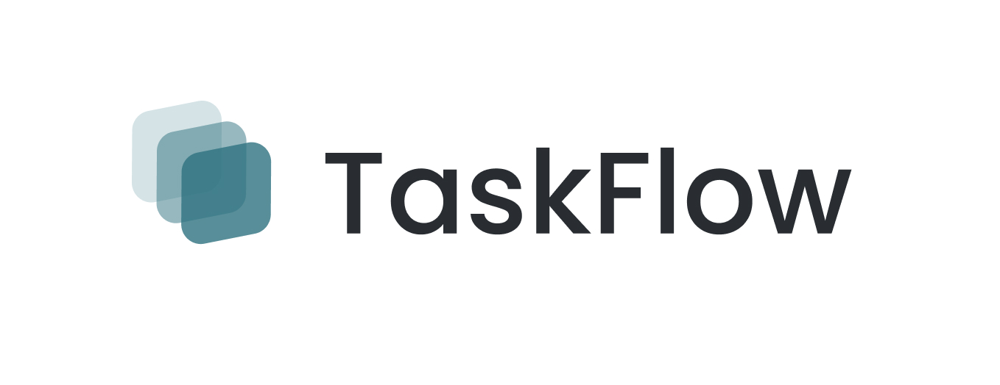
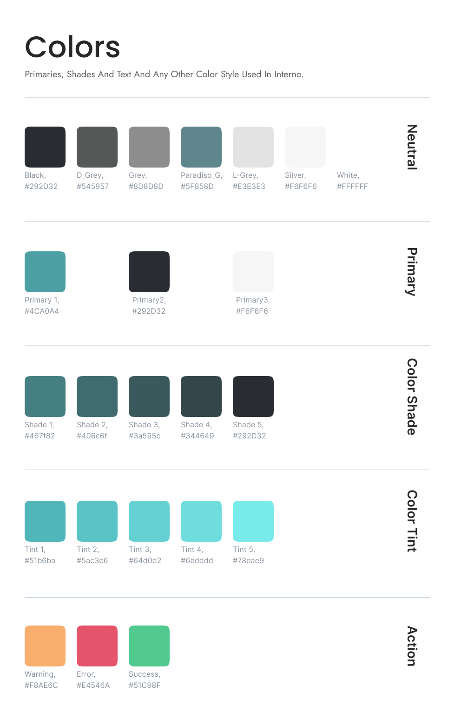

# TaskFlow
TaskFlow is a dynamic web application designed for efficient task and project management, with a strong emphasis on collaboration and real-time updates. Crafted with a visually appealing and user-friendly UI/UX, leveraging HTML and CSS, and powered by the Angular framework, TaskFlow is the ideal solution for streamlining work processes and managing projects effectively.

This project was generated with [Angular CLI](https://github.com/angular/angular-cli) version 16.2.9.

<br>

## Timeline
14 Nov 2023 - 23 Nov 2023

<br>

## Technology used
- Angular Framework
- TypeScript
- HTML and CSS
- Bootstrap

<br>

## Prerequisites
Before getting started, ensure you have the following:

- Node.js
- npm package manager
- Angular CLI
- An IDE that supports Angular Framework

<br>

## Setup
1. Clone the Repository:
``````
git clone https://github.com/randH7/TaskFlow-client
``````
2. Install Dependencies:
``````
cd TaskFlow-client
npm install
``````
3. Setup Server Side:

Follow the setup guide [here](https://github.com/randH7/TaskFlow-server) to configure the server side.

4. Run the Development Server:
``````
ng serve
``````
Open your browser and navigate to http://localhost:4200/.

> [!IMPORTANT]
> Ensure the port number in the `application.properties` file on the server side matches the port in the service files (`auth-service.service.ts` | `project.service.ts`) on the client side.

<br>

## Design

### Concept:
The TaskFlow logo symbolizes the fluidity and organization of tasks in a collaborative environment. It communicates a sense of synergy and teamwork.

### Logo:

I created this logo like flowing, straight lines to represent the smooth flow and organization of tasks. These lines are stylized to look like abstract task cards moving in a sequence.

### Color Palette:

The color palette includes modern and professional colors, with teal symbolizing trust and reliability. 

> [!NOTE]
> Explore the design in Figma [here](https://www.figma.com/file/pnCnsNGpAGpFQzudHvlxjT/Untitled?type=design&node-id=12%3A762&mode=design&t=hzqUyw3uZA13I1eo-1).

<br>

## Future Work
- Frontend for Employee Side: Develop the frontend for employee features.
- Deployment: Prepare for the deployment of the TaskFlow website.

<br>

## 🔗 Extra links
- [My Trello](https://trello.com/invite/b/tBnAEQNb/ATTI7d2d50d1771e2b1b9eb9f3e6f867bfbcA4259FB3/taskflow)
- [My presentation](https://www.canva.com/design/DAFyVn0L2aU/UFnpNoBAmP4_N0LAnmyuBQ/edit?utm_content=DAFyVn0L2aU&utm_campaign=designshare&utm_medium=link2&utm_source=sharebutton)
